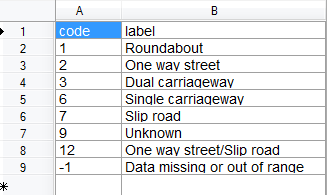

# Wstęp
## Tytuł
Zadanie nr2, agregacje na zbiorze danych o wypadkach samochodowych w UK w latach 2005-2013
## Komputer
* Procesor: Intel Core i5-3230M CPU @ 2.60GHz 4-rdzeniowy
* Pamięć RAM: 8GB
* Dysk Twardy: 1TB
* System Operacyjny: Windows 7 Professional SP1

## Software
* MongoDB w wersji 2.8.0 rc0
* Windows PowerShell

# Zadanie

## Przygotowanie

Do tego zadania użyłem bazy danych znalezionej pod adresem: [data.gov.uk](http://data.gov.uk/dataset/road-accidents-safety-data)  

Tutaj znajdują się objaśnienia do danych zawartych w tym jsonie: [guide](http://data.gov.uk/dataset/road-accidents-safety-data/resource/285ac042-97b4-4cac-b47d-160e9e0f2cd4)  

Zaimportowałem dane i zmierzyłem czas za pomocą komend:
~~~
$sw = [Diagnostics.Stopwatch]::StartNew()
./mongoimport -d acc -c accidents --type csv --file Accidents0513.csv --headerline
$sw.Stop()
~~~

import trwał 1 minute i 34 sekund.

~~~
> db.accidents.count()
1494275
~~~

Przykładowy rekord:

~~~
> db.accidents.findOne()
{
        "_id" : ObjectId("54ade6f4ff112a573fe738b8"),
        "?Accident_Index" : "200501BS00001",
        "Location_Easting_OSGR" : 525680,
        "Location_Northing_OSGR" : 178240,
        "Longitude" : -0.19117,
        "Latitude" : 51.489096,
        "Police_Force" : 1,
        "Accident_Severity" : 2,
        "Number_of_Vehicles" : 1,
        "Number_of_Casualties" : 1,
        "Date" : "04/01/2005",
        "Day_of_Week" : 3,
        "Time" : "17:42",
        "Local_Authority_(District)" : 12,
        "Local_Authority_(Highway)" : "E09000020",
        "1st_Road_Class" : 3,
        "1st_Road_Number" : 3218,
        "Road_Type" : 6,
        "Speed_limit" : 30,
        "Junction_Detail" : 0,
        "Junction_Control" : -1,
        "2nd_Road_Class" : -1,
        "2nd_Road_Number" : 0,
        "Pedestrian_Crossing-Human_Control" : 0,
        "Pedestrian_Crossing-Physical_Facilities" : 1,
        "Light_Conditions" : 1,
        "Weather_Conditions" : 2,
        "Road_Surface_Conditions" : 2,
        "Special_Conditions_at_Site" : 0,
        "Carriageway_Hazards" : 0,
        "Urban_or_Rural_Area" : 1,
        "Did_Police_Officer_Attend_Scene_of_Accident" : 1,
        "LSOA_of_Accident_Location" : "E01002849"
}
~~~

## Agregacje w Javascript

### 1. Stosunek liczby ofiar do liczby wypadków na poszczególnych rodzajach dróg.

~~~
print(db.accidents.aggregate( 
	{ 
		$group: {_id: "$Road_Type", count: {$sum: 1}, total_casualties: {$sum: "$Number_of_Casualties"}},
	},
	{
		$project: {_id: 1, ratio: {$divide: ["$total_casualties", "$count"]}}
	}
));
~~~

daje nam wynik:

~~~
{ "_id" : 9, "ratio" : 1.2533669112011387 }
{ "_id" : 7, "ratio" : 1.4151702984216243 }
{ "_id" : 1, "ratio" : 1.2642385037266208 }
{ "_id" : 3, "ratio" : 1.4812021941666178 }
{ "_id" : 2, "ratio" : 1.1935244127055935 }
{ "_id" : 6, "ratio" : 1.340248368365035 }
~~~

patrząc na objaśnienia zawarte w legendzie:

drogi z największą ilością poszkodowanych w jednym wypadku to drogi szybkiego ruchu z pasem zieleni (3) a drugi w kolejności to wjazd na autostrade (7).

### 2. Powiaty w UK, gdzie limit prędkości to conajwyżej 50 mil na godzine.

~~~
print(db.accidents.aggregate(  
	{ $group: {_id: "$Local_Authority_(District)", max_speed_limit: {$max : "$Speed_limit"}}},
	{ $match: {max_speed_limit: {$lte: 50}}}  
));
~~~

wynik:
~~~
{ "_id" : 31, "max_speed_limit" : 50 }
{ "_id" : 9, "max_speed_limit" : 50 }
{ "_id" : 57, "max_speed_limit" : 50 }
{ "_id" : 7, "max_speed_limit" : 50 }
{ "_id" : 8, "max_speed_limit" : 50 }
{ "_id" : 570, "max_speed_limit" : 50
{ "_id" : 24, "max_speed_limit" : 50 }
{ "_id" : 12, "max_speed_limit" : 50 }
{ "_id" : 3, "max_speed_limit" : 50 }
~~~

W porównaniu do 416 powiatów bardzo mała liczba.

~~~
print(db.accidents.distinct("Local_Authority_(District)").length);
~~~

### 3. Liczba poszkodowanych pogrupowana w dni, z wyłączeniem tych dni gdzie było ich mniej niż 1000

~~~
print(db.accidents.aggregate( 
 	{ $group: {_id: "$Date", total_casualties: {$sum : "$Number_of_Casualties"}}},
 	{ $match: {total_casualties: {$gte: 1000}}}
));
~~~

wynik:
~~~
{ "_id" : "06/10/2006", "total_casualties" : 1014 }
{ "_id" : "04/11/2005", "total_casualties" : 1001 }
{ "_id" : "22/09/2006", "total_casualties" : 1139 }
{ "_id" : "15/09/2005", "total_casualties" : 1012 }
{ "_id" : "29/09/2006", "total_casualties" : 1075 }
{ "_id" : "09/12/2005", "total_casualties" : 1060 }
{ "_id" : "30/09/2005", "total_casualties" : 1002 }
{ "_id" : "21/10/2005", "total_casualties" : 1157 }
{ "_id" : "18/11/2005", "total_casualties" : 1019 }
~~~

Po roku 2006 (dane na 2005-2013) nie było dnia z liczbą poszkodowanych większą niż 1000.

### 4. Liczba incydentów według dnia tygodnia

~~~
print(db.accidents.aggregate(
	{
		$group: {_id: "$Day_of_Week", count: {$sum: 1}}	
	},
	{
		$sort: {count: 1}
	}
));
~~~

wynik:
~~~
{ "_id" : 1, "count" : 164128 }
{ "_id" : 7, "count" : 200973 }
{ "_id" : 2, "count" : 212145 }
{ "_id" : 3, "count" : 222957 }
{ "_id" : 5, "count" : 224235 }
{ "_id" : 4, "count" : 224812 }
{ "_id" : 6, "count" : 245025 }
~~~

Według legendy, 1 to Niedziela, 7 to Sobota itp...
I tak, jak powszechnie wiadomo, najbezpieczniejsze są Niedziele,
a najgroźniejsze Piątki.

